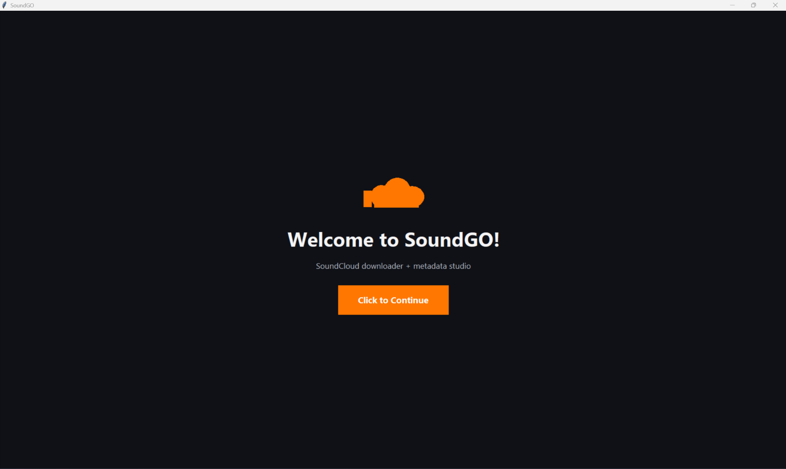
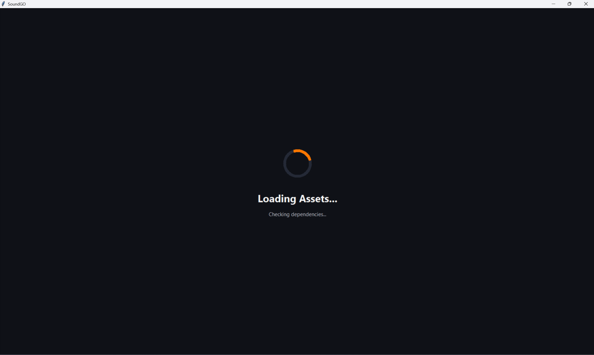
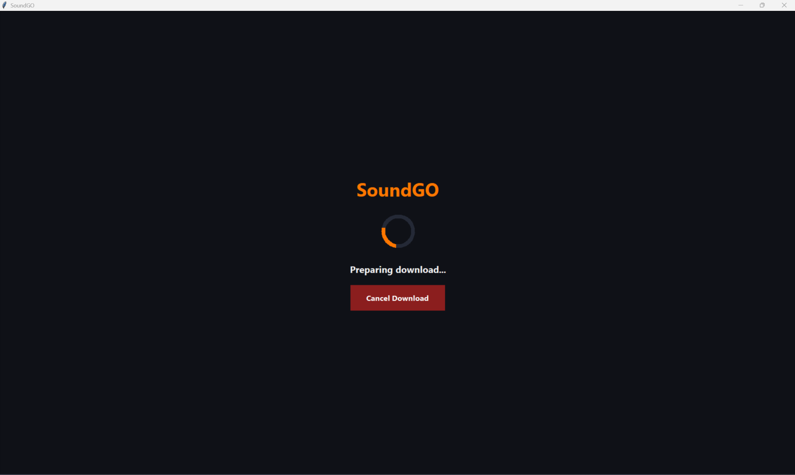
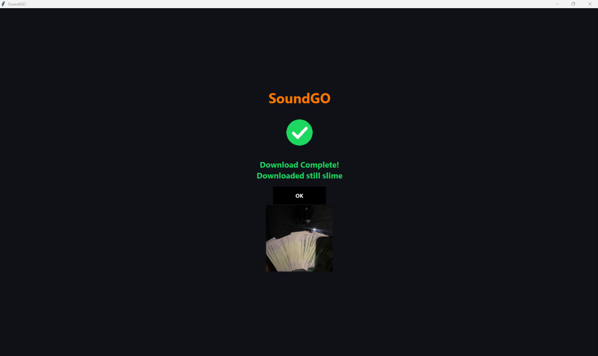
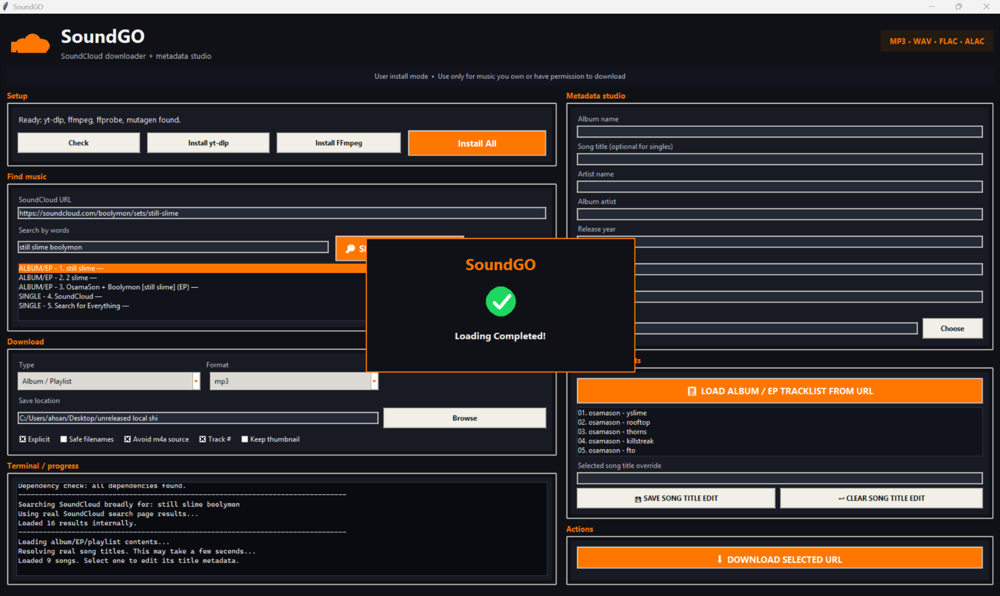

# SoundGO Beta (vibecoded lol)

---

# Notes

- SoundGO is intended only for music you own or have permission to download.
- Respect artists, copyright law, and SoundCloud’s terms of service.
- Purpose: Download, organize, and manage local audio files for music apps such as Apple Music & Spotify.

<p align="center">
  
</p>

<p align="center">
  <b>SoundCloud downloader + metadata studio</b>
</p>

---

## Features

- Broad SoundCloud search with:
  - `SINGLE -`
  - `ALBUM/EP -`
- Download singles, albums, EPs, and playlists.
- Metadata editor:
  - Album name
  - Song title
  - Artist
  - Album artist
  - Year
  - Genre
  - Cover art
  - Explicit tag
- Album/EP tracklist editor.
- Automatic metadata rewriting using Mutagen.
- Full-window animated loading screens.
- Cover-art completion screen.
- Default collection folder:
  - `Desktop/SoundGO Collection`

---

# Screenshots

## Welcome Screen

Shows the animated startup interface before entering SoundGO.


---

## Dependency / Asset Loading Screen

Animated loading screen while SoundGO initializes assets and checks dependencies.



---

## Download Progress Screen

Full-screen in-app download overlay with:
- animated loading icon
- current song status
- cancel button



---

## Download Complete Screen

Completion screen with:
- green checkmark
- downloaded album/song name
- cover art preview
- OK button



---

## Album / EP Tracklist Loading

Mini in-window loading panel shown while SoundGO resolves playlist tracks.



---

# Installation

## Python Version

Recommended:
- Python 3.10+
- Windows 10/11

---
## Prebuilt EXE

A prebuilt Windows EXE version of SoundGO is available in the GitHub Releases section.

No Python installation is required for the EXE release.

---


## Install Dependencies

```bash
pip install -r requirements.txt
```

---

## Install FFmpeg

Windows:

```cmd
winget install Gyan.FFmpeg
```

Restart your terminal or restart SoundGO afterward.

---

# Running SoundGO

## Python

```bash
python app.py
```

## No-console Windows launch

```cmd
run_app.vbs
```

---

# Project Structure

```text
SoundGO/
├─ app.py
├─ requirements.txt
├─ README.md
├─ assets/
│  ├─ welcome_screen.png
│  ├─ dependency_loading.png
│  ├─ download_progress.png
│  ├─ download_complete.png
│  └─ album_loading_complete.png
```
