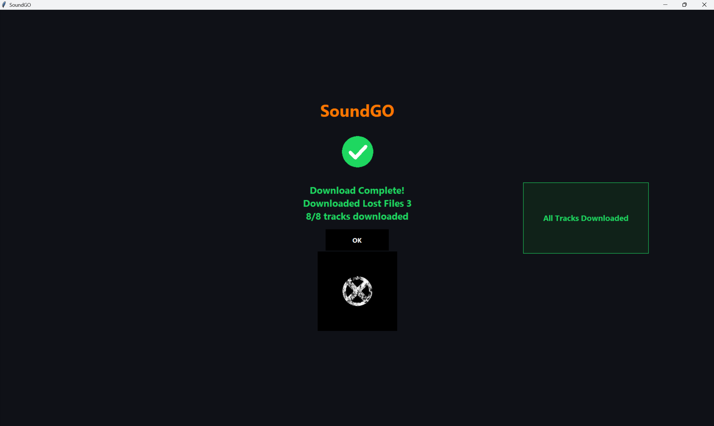

# SoundGO

<p align="center">
  
</p>

<p align="center">
  <b>SoundCloud downloader + metadata studio</b>
</p>

---

## Features

- Broad SoundCloud search with:
  - `SINGLE -`
  - `ALBUM/EP -`
- Download singles, albums, EPs, and playlists.
- Metadata editor:
  - Album name
  - Song title
  - Artist
  - Album artist
  - Year
  - Genre
  - Cover art
  - Explicit tag
- Album/EP tracklist editor.
- Automatic metadata rewriting using Mutagen.
- Full-window animated loading screens.
- Cover-art completion screen.
- EXE builder included.
- Default collection folder:
  - `Desktop/SoundGO Collection`

---

# Screenshots

## Welcome Screen

Shows the animated startup interface before entering SoundGO.


---

## Dependency / Asset Loading Screen

Animated loading screen while SoundGO initializes assets and checks dependencies.


---

## Download Progress Screen

Full-screen in-app download overlay with:
- animated loading icon
- current song status
- cancel button


---

## Download Complete Screen

Completion screen with:
- green checkmark
- downloaded album/song name
- cover art preview
- OK button



---

## Album / EP Tracklist Loading

Mini in-window loading panel shown while SoundGO resolves playlist tracks.


---

# Installation

## Python Version

Recommended:
- Python 3.10+
- Windows 10/11

---
## Prebuilt EXE

A prebuilt Windows EXE version of SoundGO is available in the GitHub Releases section.

No Python installation is required for the EXE release.

---


## Install Dependencies

```bash
pip install -r requirements.txt
```

---

## Install FFmpeg

Windows:

```cmd
winget install Gyan.FFmpeg
```

Restart your terminal or restart SoundGO afterward.

---

# macOS Installation

## Requirements

- macOS 12+
- Python 3.10+
- Homebrew recommended

---

## 1. Install Homebrew (if not installed)

Open Terminal and run:

```bash
/bin/bash -c "$(curl -fsSL https://raw.githubusercontent.com/Homebrew/install/HEAD/install.sh)"
```

---

## 2. Install FFmpeg

```bash
brew install ffmpeg
```

Verify installation:

```bash
ffmpeg -version
ffprobe -version
```

---

## 3. Install Python Dependencies

Navigate to the SoundGO folder:

```bash
cd SoundGO
```

Install dependencies:

```bash
pip3 install -r requirements.txt
```

---

## 4. Run SoundGO

```bash
python3 app.py
```

---

# macOS EXE Equivalent (.app)

macOS does not use `.exe` files.

To create a standalone macOS app:

```bash
pip3 install pyinstaller
```

Then run:

```bash
pyinstaller --windowed --onefile app.py
```

The macOS app will appear in:

```text
dist/
```

---

# Notes for macOS Users

- Downloads save to:
  ```text
  Desktop/SoundGO Collection
  ```
  by default.
- Some macOS versions may ask for permission to access:
  - Desktop
  - Downloads
  - Music folders
- If SoundGO is blocked by macOS Gatekeeper:
  - Open:
    ```text
    System Settings → Privacy & Security
    ```
  - Click:
    ```text
    Open Anyway
    ```

---

# Apple Silicon Support

SoundGO works on:
- Intel Macs
- Apple Silicon Macs (M1/M2/M3)

Recommended Python version:
```text
Python 3.10+
```

# Running SoundGO

## Python

```bash
python app.py
```

## No-console Windows launch

```cmd
run_app.vbs
```

---

# Notes

- SoundGO is intended only for music you own or have permission to download.
- Respect artists, copyright law, and SoundCloud’s terms of service.

---

# Project Structure

```text
SoundGO/
├─ app.py
├─ requirements.txt
├─ README.md
├─ assets/
│  ├─ welcome_screen.png
│  ├─ dependency_loading.png
│  ├─ download_progress.png
│  ├─ download_complete.png
│  └─ album_loading_complete.png
```


---

## Search/URL Fix

This package includes a SoundCloud URL validation patch.

It fixes generated search URLs like:

```text
https://soundcloud.comusername/sets/example
```

and normalizes them to:

```text
https://soundcloud.com/username/sets/example
```

SoundGO also checks selected SoundCloud URLs before downloading and warns if a page is unavailable, deleted, private, or a bad scraped result.


---

## v5 SoundCloud Download Retry Fix

This patch changes SoundGO so browser-valid SoundCloud URLs are not blocked by the app's URL checker.

It also automatically retries once after refreshing `yt-dlp` if SoundCloud returns:

```text
Unable to download JSON metadata: HTTP Error 404
```

This error is often caused by SoundCloud extraction/API changes rather than the link being invalid in your browser.


---

## v6 Partial Playlist Completion

If SoundCloud/yt-dlp returns an error after some playlist tracks still downloaded, SoundGO now treats it as a partial completion instead of a total failure.

The completion screen now shows:

```text
X/Y tracks downloaded
```

If any tracks are missing, SoundGO lists them on the side of the completion screen.
